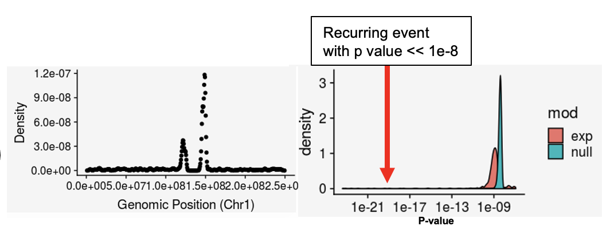
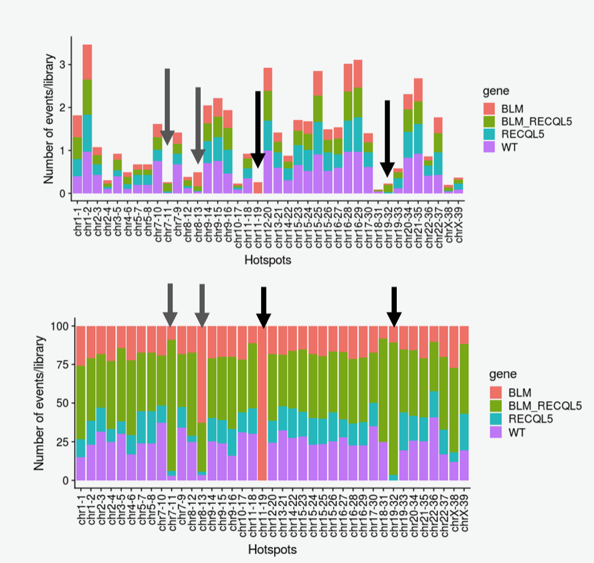
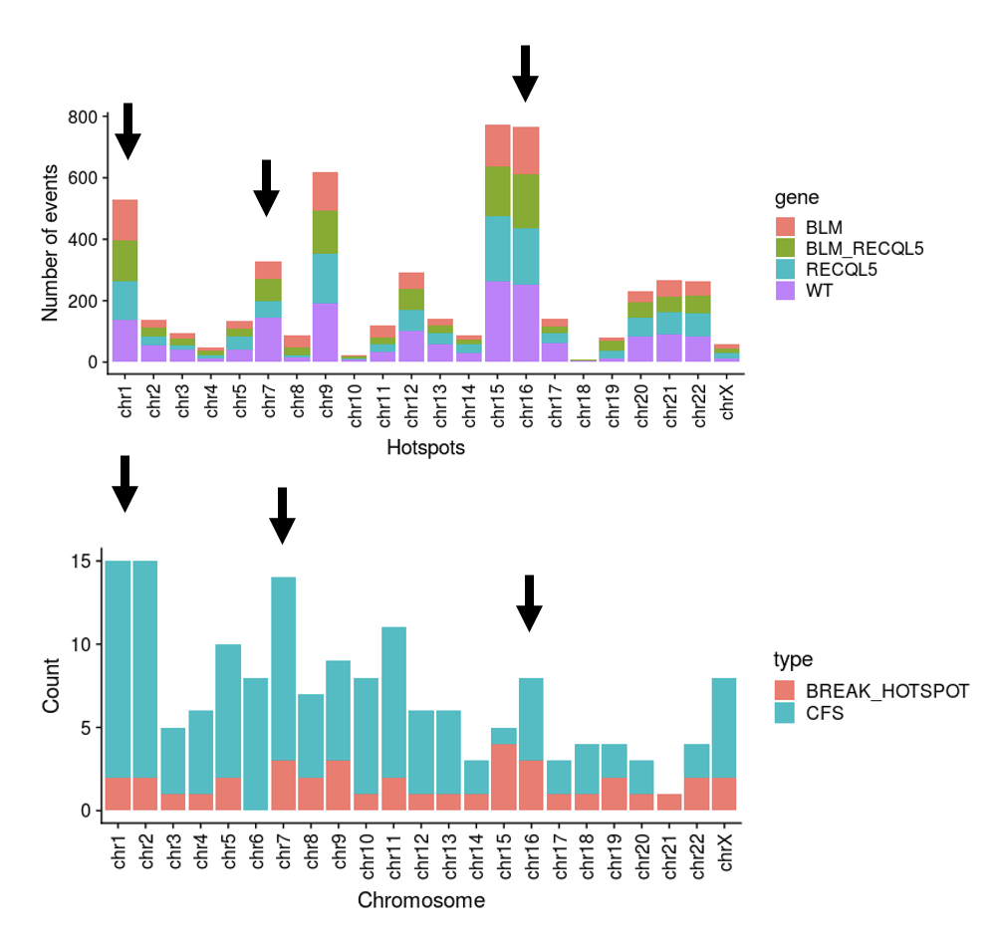
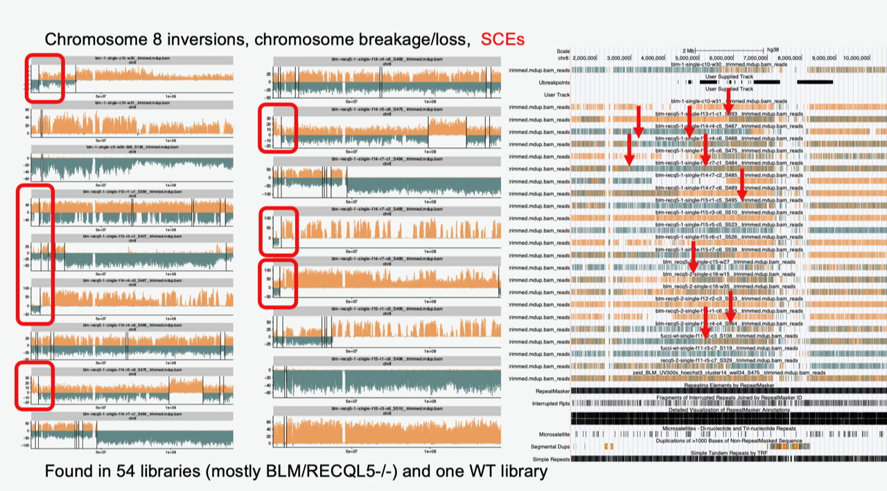
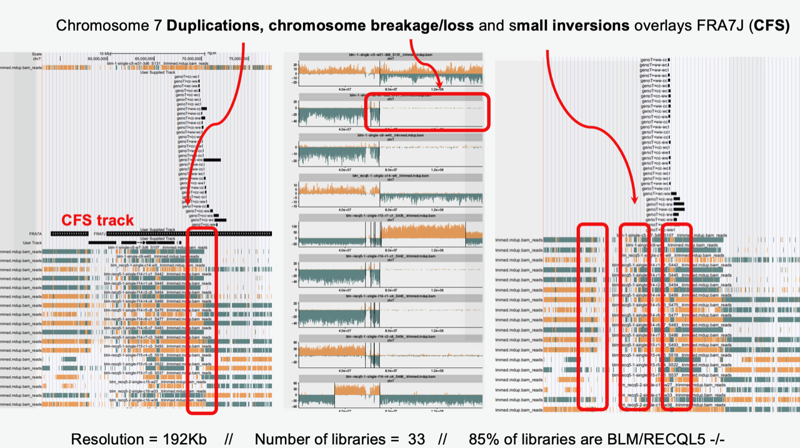

## Structural Variant Hotspots

### Structure
1. Collect all breakpoints from RData files produced by `breakpointR` in datapath
2. Compare density distribution of events on each chromosome to null gaussian distribution of events
3. Assign p-values and collect areas with p-values < 1e-8

4. Create file structure for each hotspot stored in `HOTSPOTS/`
    * reads.bed files for all libraries involved
    * breakpoints.bed for breakpoint coordinates
    * chr_breakpoints.pdf for chromosome-specific ideogram plotting
    * genotype.txt for summary of genotype results

5. One summary file for all inversions, each row:
    * chr, mean(start), mean(end), mean(width), # of libraries, % BLM, % RECQL5, % BLM-RECQL5, % WT 

    
### How to use

* Check datapaths of [hotspotter.R]("hotspotter.R") and the run the `master()` function in there
* Run [the concatenation script]("concatenateReadsBED.sh") to combine reads from multiple libraries in each hotspot to allow for easy UCSC genome browser upload
* Collect summary files and plots in the `PLOTS/` folder
* Upload the following to the genome browser to invetigate hotspot:
    a. Concatenated BED file of reads
    b. Breakpoints BED file 
    c. Common fragile sites BED file
  
### Functionality

##### Compare distribution summary to known CFSs

##### HOTSPOT: chromosome 8

##### HOTSPOT: chromosome 7

